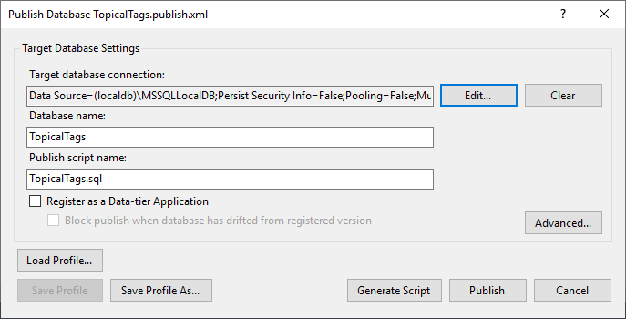
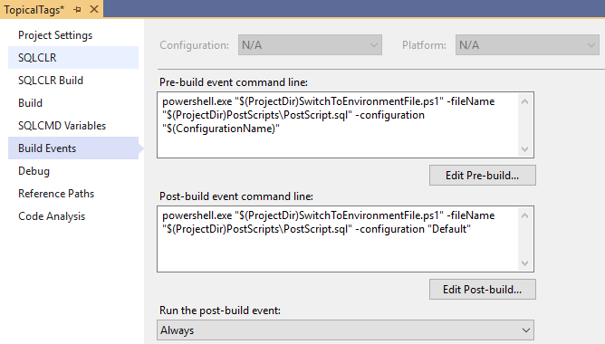

# Migracja Bazodanowa

Pomiń wstępniak >>

## Emigracja nie taka fajna

Jak w świecie, tak w wielu projektach IT temat wszelakich migracji, emigracji i imigracji może rozpalić.
Ze łzą w oku wspominam projekt do którego dołączyłem (wyemigrowałem) już w jego trakcie, ale jeszcze w fazie przed premierą. Nowa praca, nowe wyzwania, yeah!
Zdaje się, że w 09/2012 został zaprezentowany Entity Framework 4 z podejściem Code First, a w tym samym miesiącu baza danych projektu mogła już mieć z 100MB + 20MB CMS.
Już pierwsze zaciągnięcie z SVN'a nie zapowiadało dobrego startu. Wszystkie skompilowane binaria C# zaciągały się również. Wisienką na torcie były jednak dwa rozpaśne pliki \*.bak.

## Czy leci z nami pilot

Już wkrótce czekała mnie pierwsza zmiana na bazie danych.

1. Zaciągnąłem świeży \*.bak z SVN'a
2. Wykonałem restore na moim lokalnym MSSQL. Ajć, zapomniałem ustawić opcji, żeby wyczyścił starą bazę do cna, w przeciwnym wypadku mieliśmy jakieś dziwne problemy... ale nie pamiętam już na szczęście o co chodziło. No to jeszcze raz restore. Yes, udało się.
3. Szczęście, że zespół był w jednym pomieszczeniu, więc uprzejmie informowałem, że dokonuję zmiany na bazie danych (oj takie tam dodawanie kolumny). Tak naprawdę przebąkiwałem już o tej zmianie trochę wcześniej, żeby nikt inny nie zabierał się za podobne wyczyny.
4. Dodałem kolumnę, na szybko sprawdziłem czy czegoś nie zapomniałem.
5. Super, Backup robię zamiast starego \*.bak i jazda na SVN z 100MB'owym plikiem.
6. Uprzemie informowałem, że skończyłem.

Wrzucenie tego na serwer testowy było nieco krótsze. Kopiowanie \*.bak na dysk sieciowy i informacja do technicznego managera u klienta, że może sobie zaaplikować. To nic, że dane się resetowały - to w końcu jeszcze testy :)

Co robisz jak trafiasz do takiego projektu? Nie, nie uciekasz. Mierzysz się z Goliatem!

## 6 wyzwań migracji

Najprostrzy scenariusz zakłada, że dane w trakcie działania aplikacji się nie zmieniają i są zawsze dostarczane z nową wersją jako statyczny zasób. A no i trzeba jeszcze założyć, że zespół składa się z jednego programisty. W przeciwnym wypadku i tak trzeba znaleźć sposób na dzielenie się tą samą bazą bez zaburzenia pracy innych. W takim scenariuszu jednak i tak wybrany sposób aktualizacji takiej bazy może być znacząco prostrzy od baz "żyjących swoim życiem".
To jest znacząca różnica między kodem programu, który zwykle dostarczymy kopiując kilka plików, a danymi, które mogą się zmieniać i mają swoją autonomię. Dodając do tego przykład ze wstępu, widzimy jakie wyzwania nas czekają:

1. **Źródło Prawdy** Musisz wybrać źródło prawdy (jak i w życiu) co do modelu bazy; gdzie będziesz ją (prawdę) trzymać? Czy baza danych czy kod programu definiują jej strukturę? _Database First_ czy _Code First_? A może _Model First_? Nową wersję przechowujemy jako stan bazy czy listę zmian?
2. **Aktualizacja Struktur i Danych** Musisz zabezpieczyć możliwość aktualizacji bazy produkcyjnej bez zniszczenia danych:
   a. dodawanie/usuwanie/zmienianie kolumny w bazach relacyjnych;
   b. aktualizacja struktur (np. w NoSQL)
   c. aktualizacja danych lub synchronizowanie danych (np. w przypadku, gdy mamy tabelę z wartościami konfiguracyjnymi aplikacji, która może być zmieniana w panelu admina, ale jednocześnie chcemy zapewnić, że domyślne dane zawsze tam będą).
3. **Automatyzacja** Powinieneś uwzględnić możliwość automatycznego wykonania takiej aktualizacji. Jak wykrywasz różnice? Jak te różnice zaaplikować na bazę?
4. **Współdzielenie Kodu i Rozwiązywanie Konfliktów** Jak rozwiązujesz konflikty w repozytorium kodu? Ups, Nie wspomniałem? TAK, model bazy powinien być częścią kodu.
5. **Dywersyfikacja Środowiska** Czy potrzebujesz zróżnicować dane początkowe ze względu na środowisko (Dev, Test, QA, Produkcja)? Może lista wymaganych użytkowników musi być różna? Może na Dev/Test chcesz nawrzucać trochę śmieci testowych? Więc jak to zrobisz?
6. **Synchronizacja z aplikacją - warstwą dostępu do danych** Jak łatwo przeniesiesz zmiany na bazie do kodu aplikacji?

Powyższe wyzwania uniwersalne bez względu na język programowania czy bazę. No może poza wyjątkiem użycia Oracle'a. Wtedy będzie trzeba dołożyć do listy ;)
W kolejnych rozdziałach zajmę się wybranymi rozwiązaniami tego zagadnienia wykorzystującymi podejście _Database First_ i _Code First_ co odzwierciedla **Źródło Prawdy** - to gdzie przechowywana jest wiedza na temat stanu bazy. Odpowiadając sobie na pytanie "jakie podejście zastosujesz jeśli chodzi o bazę danych", zwykle programista pomyśli "Database First" albo "Code First" albo "Model First". W drugiej kolejności przyjdą odpowiedzi pytania 2-6. To pokazuje, że jest to jednak najistotniejsza sprawa.
W artykule pominę _Model First_ z którym osobiście najmniej miałem do czynienia. Warto jednak mieć go z tyłu głowy jako dobry start dla projektu, gdy trzeba modelować strukturę danych ściśle według wskazówek eksperta domeny, który nie rozumie SQL'a czy C#. Dla programisty jednak zwykle _Model First_ wprowadza dodatkową abstrakcję, która nie ma wartości dodanej jeśli chodzi o działanie aplikacji. Na pewno jednak pozwala lepiej zobrazować stan bazy.

### Źródło Prawdy - stan czy tranzycje?

Niezależnie od wybranego podejście nie jest dobrze, aby strukturę bazy danych trzymać w samej instancji bazy albo jakimkolwiek binarnym tworze. Powinna ona sprowadzać się do kodu utrzymanego w kontroli wersji (to raz) i pozwalać na łatwą edycję i rozwiązywanie konfliktów. Mając jednak kod możemy trzymać **stan** struktury bazy (zbiór tabel, widoczków itd.) i/lub listę zmian powstałych w trakcie rozwoju oprogramowania - **tranzycji**.  
Nawet jeśli w kodzie będziemy przechowywać sam **stan** to musimy umieć uzyskać tranzycje, które będą użyte do zaktualizowania baz danych na kolejnych środowiskach - może to jednak być zautomatyzowane (choć lepiej, żeby generowanie takiego skryptu _musiało_ być automatyczne).

## Database First

Podejście database first zakłada, że źródło prawdy jest zdefiniowane w języku bazy danych. Ona powstaje pierwsza i determinuje model i kod programu.
W przypadku _Database First_ **stanem** będzie zbiór skryptów opisujących pełne obiekty bazy danych np. zupełna definicja tabeli:

```sql
CREATE TABLE dbo.MyTableState
(
	Id bigint NOT NULL,
	Version int NOT NULL,
	ColumnAddedInVersion2 varchar(200) NOT NULL
)
```

natomiast **tranzycją** skrypt, który zawiera wszystkie zmiany na bazie dla kolejnej jej wersji:

```sql
ALTER TABLE dbo.MyTableState
ADD COLUMN ColumnAddedInVersion2 VARCHAR(200) NOT NULL
```

Możemy również połączyć jedno i drugie aby w danej chwili mieć pełny obraz bazy danych w kodzie. Zaimplementujemy rozwiązanie, następnie obronimy go względem "szóstki".

### Narzędzia

1. [SqlProject dla Visual Studio](https://docs.microsoft.com/en-us/sql/ssdt/download-sql-server-data-tools-ssdt) do zarządzania skryptami
2. [SqlPackage.exe](https://docs.microsoft.com/en-us/sql/tools/sqlpackage-download) do automatyzacji
3. [DbUp](https://dbup.readthedocs.io/en/latest/) do automatyzacji wersji wzbogaconej o tranzycje
4. [Entity Framework Core](https://docs.microsoft.com/en-us/ef/core/) do synchronizacji kodu (użyjemy v2.x.x)

### Podstawowa Implementacja - Aktualizacja, Automatyzacja i AAARozwiązywanie Konfliktów

Nową solucję stworzymy zaczynając od projektu _SQL Server Database Project_.
Produktem tego projektu jest binarny plik DACPAC zawierający `schema` i dane pochodzące ze skryptów. Pozwala on narzędziu SqlPackage na porównanie DACPAC z docelową bazą danych i automatyczne wygenerowanie skryptów tranzycji oraz zastosowanie ich na tej bazie.
Stworzymy prostą bazę zawierającą tabelę `Topic` z linkami do artykułów tematycznych oraz `Tag` do oznaczania tematów odpowiednimi etykietami. Pomiędzy nimi zachodzi relacja wiele do wielu - stąd tabela pośrednicząca TopicTags. Na koniec dodamy skrypt do wypełnienia tabel danymi testowymi - `TagConfiguration.sql` z listą tagów oraz `TestData.sql` z testową listą tematów. Będą one korzystać z opcji "Post Deploy", co spowoduje, że wykonają się po tym jak wszystkie tabelki będą gotowe. Z uwagi na to jednak, że możemy mieć tylko jeden skrypt "Post" lub "Pre" w projekcie, to połączymy je dodatkowym plikiem `PostScript.sql`
W nawiasie podaję _Build Action_ jaki musimy ustawić we właściwościach pliku (PPM na pliku / Properties).

```
|- Schema
   |- Tag.sql (Build)
   |- Topic.sql (Build)
   |- TopicTags.sql (Build)
|- PostScripts
   |- PostScript.sql (Post Deploy)
   |- TagConfiguration.sql (None)
   |- TestData.sql (None)
```

A tak wyglądają skrypty:

```sql
# Tag.sql
CREATE TABLE [dbo].[Tag]
(
	[Id] INT NOT NULL PRIMARY KEY,
	[Name] VARCHAR(255)
)
```

```sql
# Topic.sql
CREATE TABLE [dbo].[Topic]
(
	[Id] INT NOT NULL PRIMARY KEY,
	[Title] VARCHAR (2000) NOT NULL,
	[Url] VARCHAR (2000) NOT NULL
)
```

```sql
# TopicTags.sql
CREATE TABLE [dbo].[TopicTags]
(
	[TopicId] INT NOT NULL,
	[TagId] INT NOT NULL,
	CONSTRAINT PK_TopicTags PRIMARY KEY (TopicId, TagId),
    CONSTRAINT [FK_TopicTag_ToTopic] FOREIGN KEY ([TopicId]) REFERENCES [Topic]([Id]),
    CONSTRAINT [FK_TopicTag_ToTag] FOREIGN KEY ([TagId]) REFERENCES [Tag]([Id])
)
```

```sql
# TestData.sql
IF NOT EXISTS (SELECT TOP 1 Id FROM Topic)
BEGIN
    PRINT 'Data seed - Inserting test [Topic]'
	INSERT INTO Topic (Id, Title, Url) VALUES (1, 'Origin of Life Problems for Naturalists','https://answersingenesis.org/origin-of-life/origin-of-life-problems-for-naturalists/');
	INSERT INTO TopicTags (TopicId, TagId) VALUES (1,1), (1,9), (1,10);

	INSERT INTO  (Id, Title, Url) VALUES (2, 'Power Plants','https://answersingenesis.org/biology/plants/power-plants/');
	INSERT INTO TopicTags (TopicId, TagId) VALUES (2,1), (2,4), (2,5), (2,6);

	INSERT INTO Topic (Id, Title, Url) VALUES (3, 'Evidence for a Young World','https://answersingenesis.org/astronomy/age-of-the-universe/evidence-for-a-young-world/');
	INSERT INTO TopicTags (TopicId, TagId) VALUES (3,1), (3,4), (3,7), (3,8);

	INSERT INTO Topic (Id, Title, Url) VALUES (4, 'Are Atheists Right? Is Faith the Absence of Reason/Evidence?','https://answersingenesis.org/christianity/are-atheists-right/');
	INSERT INTO TopicTags (TopicId, TagId) VALUES (4,1), (4,2), (4,3);

END;
```

```sql
# TagConfiguration.sql

-- W przypadku Tagów zastosujemy podejście UPSERT.
-- Chcemy zawsze zadbać o to, że w bazie będzie te 10 tagów jednocześnie pozwalając, że w aplikacji może zachodzić jakaś administracja i dodawanie nowych tagów.

-- Cloning Tags into temp table
SELECT TOP 0 * INTO #TempTags FROM dbo.[Tag]

-- Seeding data
PRINT 'Data seed - Merging [Tags]'
INSERT INTO #TempTags ([Id], [Name]) VALUES
		(1, 'Answers'),
		(2, 'Worldview'),
		(3, 'Christianity'),
		(4, 'Science'),
		(5, 'Biology'),
		(6, 'Plants'),
		(7, 'Astronomy'),
		(8, 'Age of the Universe'),
		(9, 'Evolution'),
		(10, 'Origin of Life');

-- UPSERT
merge into dbo.[Tag] as Target
using #TempTags as Source
on Target.Id=Source.Id
when matched then
update set Target.[Name] = Source.[Name]
when not matched then
insert ([Id], [Name]) values (Source.[Id], Source.[Name]);

DROP TABLE #TempTags;
```

```sql
# PostScript.sql
print "Running Post Deploy Scripts"
:r .\TagConfiguration.sql
:r .\TestData.sql

```

W _Solution Explorer_ na tym projekcie mamy opcję _Publish_. Wybierając ją możemy zdefiniować profil publikowania bazy danych.
Ustawmy:

1. _Connection String_ połączenia do bazy danych - ja użyje lokalnej bazy dla _Debug_
   `Data Source=(localdb)\MSSQLLocalDB;Integrated Security=True;`
2. Nazwę bazy danych na _TopicalTags_
3. Nazwę skryptu _TopicalTags.sql_

Resztę pozostawiamy domyślnie, natomiast profil chcemy zapisać - Save Profile As...


W tej chwili możemy już zaktualizować automatycznie naszą bazę - przez Publish, lub wygenerować skrypt, który aplikujemy na bazę (uwaga! jest on przygotowany do trybu działania przez SQLCMD więc użycie w Management Studio wymaga kilku zabiegów, które tutaj pominiemy).

Plik \*.publish.xml możemy również użyć w narzędziu _SqlPackage.exe_. Utworzymy sobie krótki skrypt DeployDebug.ps1:

```powershell
# Ścieżka Zależy od wersji
$sqlPackageExe = "C:\Program Files (x86)\Microsoft SQL Server\140\DAC\bin\SqlPackage.exe"
&$sqlPackageExe /Action:Publish  /SourceFile:"./bin/Debug/TopicalTags.dacpac" /Profile:TopicalTags.publish.xml
```

Odpalenie skryptu już bez pytania aktualizuje nam bazę. Możemy jednak na wiele innych sposobów ustawić sobie parametry tego procesu np. w Continues Delivery - SqlPackage ma wiele parametrów https://docs.microsoft.com/en-us/sql/tools/sqlpackage.

Taki zestaw skryptów bez problemu udostępniamy w naszym repozytorium kodu i rozwiązywanie konfliktów odbywa się jak w przypadku każdego innego skryptu.

### Dywersyfikacja Środowiska

Dla środowiska lokalnego i deweloperskiego wrzucamy sobie podstawowe `Tag` i trochę testowych `Topic`. Na QA a już w szczególności na Produkcji nie chcemy tych danych. Przydadzą się jednak wciąż Tagi - załóżmy, że zawsze chcemy, aby w aplikacji było dostępnych naszych 10 tagów ze skryptu, natomiast administratorzy będą mogli dodawać więcej.

Skorzystamy z konfiguracji kompilacji, jakie możemy sobie ustawić w naszym projekcie. Mamy już `Debug` i `Release`, możemy również dodać kolejne typu `QA/Test/Dev`. Konfiguracje te są również łatwe do wybrania w różnych środowiskach automatyzujących proces kompilacji np. w TFS.
**No, ale jak sprawić, że dla Debug czy Dev będziemy mieli dane testowe a dla pozostałych tylko wymaganą konfigurację?**

Wykorzystamy Pre i Post Build Events:


**Co będzie robić tajemniczy skrypt SwitchToEnvironmentFile.ps1?**
TODO FILMIK

Jako parametr przyjmujemy plik "bazowy" Post lub Pre Deploy oraz wybraną konfigurację.
Śledząc wykonanie w Pre-Build:

```powershell
param (

    [Parameter(Position = 0, Mandatory = $true)]
    [string]
    $fileName,
    [Parameter(Position = 1, Mandatory = $true)]
    [string]
    $configuration
)

Write-Output "Switching file into other environment"
Write-Output "scriptName = $fileName"
Write-Output "configuration = $configuration"
```

Szukamy pliku w tym samym folderze według konwencji `NazwaPlikuBazowego.Konfiguracja.rozszerzenie`

```powershell
$fileBase = [System.IO.Path]::GetFileNameWithoutExtension($fileName) # Nazwa pliku "bazowego" jest częścią wspólną z plikiem docelowym.
$fileExtension = [System.IO.Path]::GetExtension($fileName) # Rozszerzenie się przyda później
$fileBaseBackup = [System.IO.Path]::GetTempFileName() # Zrobimy też kopię oryginalnego pliku
$workingDirectory = [System.IO.Path]::GetDirectoryName($fileName)

# Szukamy pliku według konwencji - nazywa się tak samo jak plik bazowy + .Konfiguracja i ma to samo rozszerzenie
$configurationSpecificFile = [System.IO.Path]::Combine($workingDirectory, "$fileBase.$configuration$fileExtension")

Write-Output "Configuration Specific File: $configurationSpecificFile"
Write-Output "Backup of Default file at: $fileBaseBackup"

```

Nadpisujemy blik bazowy tym specyficznym dla konfiguracji.

```powershell
try {

    if (Test-Path $configurationSpecificFile) {
		if(Test-Path $fileName)
		{
			Write-Output "Backing $fileName"
			Move-Item $fileName $fileBaseBackup -Force
		}
        Copy-Item $configurationSpecificFile $fileName
    }
    else {
        Write-Output "Configuration specific file '$configurationSpecificFile' does not exists. No substitution will be done"
    }
}
catch {
    $ex = $_.Exception.Message
    Write-Output "Ended with errors:"
    Write-Output $ex
    Write-Output "Reverting file: $fileName"
    Move-Item $fileBaseBackup $fileName -Force
}
finally {
    if (Test-Path $fileBaseBackup) {
        Remove-Item $fileBaseBackup
    }
}

```

W Post-Build podmieniamy natomiast plik konfiguracją nazwaną "Default" - plik PostScript.Default.sql powinien być taki sam jak PostScript.sql - unikniemy w ten sposób ciągle zmieniającego się pliku. Moglibyśmy również użyć tymczasowego pliku na przechowanie zawartości domyślnej - w ten sposób unikniemy też przechowywania dwóch takich samych plików w naszym repo.

Aby przetestować nasze rozwiązanie, dodajmy plik PostScript.Debug.sql, który powinien być wykonany tylko w przypadku tejże konfiguracji.

```sql
:r .\TagConfiguration.sql
:r .\TestData.sql

IF NOT EXISTS (SELECT TOP 1 Id FROM Topic WHERE Id = 100)
BEGIN
	INSERT INTO Topic (Id, Title, Url) VALUES (100, 'DEBUG','localhost');
END;
```

## Synchronizacja z ORM

W momencie jak to piszę, Entity Framework Core (dalej EF) jeszcze nie wspiera relacji wiele do wielu zbyt dobrze ([link do github](https://github.com/aspnet/EntityFramework/issues/1368)).
Będziemy musieli zadowolić się obiektem pośredniczącym. Zobaczymy jednak jak szybko można coś wygenerować. Dalszy opis zakłada, że znasz podstawy EF oraz wiesz czym jest obiekt kontekstu `DbContext`

Listę linków z tagami wypiszemy w najprostrzej aplikacji ASP.NET Core (MVC). Po utworzeniu projektu zaczniemy od wygenerowania modelu naszej bazy. Zainstalujmy Entity Framework Core wraz z narzędziami.

```powershell
dotnet add package Microsoft.EntityFrameworkCore --version 2.2.6
```

Dodajmy do appsettings.json nasz Connection String:

```json
{
  "...": "...",
  "ConnectionStrings": {
    "DefaultDatabase": "Server=(localdb)\\mssqllocaldb;Database=TopicalTags;Integrated Security=True"
  }
}
```

I skorzystamy z narzędzi EF do wygenerowania naszego modelu. Ponieważ w typowej aplikacji będziemy to robić wielokrotnie, stwórzmy odrazu mały skrypt:

```powershell
# Update-Model.ps1

dotnet ef dbcontext scaffold `
   name=DefaultDatabase `
   Microsoft.EntityFrameworkCore.SqlServer `
   --output-dir Model `
   --context TopicContext `
   --force --verbose
```

Opis:

- [dotnet ef dbcontext scaffold] Używamy możliwości CLI dotnet, aby:
- [name=DefaultDatabase] - dla połączenia o nazwe DefaultDatabase (można tutaj podać też ConnectionString)
- [Microsoft.EntityFrameworkCore.SqlServer] - dostawcy połączenia dla MS SqlServer
- [--output-dir Model] - w folderze Model
- [--context TopicContext] - stworzyć implementację kontekstu TopicContext i klas modelu wygenerowanych na podstawie bazy
- [--force] - i wymusić aktualizację w przyszłości, gdy pliki będą istnieć
- [--verbose] - oraz dostać dodatkowe informacje na temat procesu.

Po uruchomieniu skryptu otrzymujemy wygenerowane klasy per tabela oraz naszą implementację kontekstu EF.
W przypadku aplikacji ASP.NET Core wystarczy jeszcze dodać nasz kontekst do kontenera IoC w Startup.cs.

```csharp
public class Startup
{
    //...

    public void ConfigureServices(IServiceCollection services)
    {
        // ...
        services.AddDbContext<TopicContext>();
    }

    // ...
}
```

Nasz kontekst zostanie wstrzyknięty automatycznie tam, gdzie o niego poprosimy. Zaimplementujmy prostą logikę zwracania danych w HomeController.Index:

```csharp
using Microsoft.AspNetCore.Mvc;
using Microsoft.EntityFrameworkCore;
using System.Linq;
using TopicalTagsWebTest.Model;

namespace TopicalTagsWebTest.Controllers
{
    public class HomeController : Controller
    {
        private TopicContext Repo { get; }

        public HomeController(TopicContext repo)
        {
            Repo = repo;
        }

        public IActionResult Index()
        {
            var allTopics = Repo.Topic
                .Include(t => t.TopicTags)
                .ThenInclude(t => t.Tag)
                .ToList();
            return View(allTopics); // Zwracamy obiekty bezpośrednio dla uproszczenia przykładu.
        }
    }
}
```

Wyświetlmy je na widoku Home/Index.cstml

```html
@{ ViewData["Title"] = "Home Page"; @using TopicalTagsWebTest.Model }
<div>
  <ul>
    @foreach (Topic topic in Model) {
    <li>
      <a href="@topic.Url" title="@topic.Url">@topic.Title</a>
      @foreach (Tag tag in topic.TopicTags.Select(t => t.Tag)) {
      <span class="badge badge-primary">@tag.Name</span>
      }
    </li>
    }
  </ul>
</div>
```

### Konfiguracja z życia wzięta

SqlPackage jest całkiem rozbudowanym narzędzeniem i może służyć do rozwiązania niejednego problemu. W jednym z projektów mamy środowisko Dev, QA i Prod no i swoją lokalną bazkę. Bazy siedzą na współdzielonym serwerze, gdzie nie możemy sobie pozwolić na ustawienie w profilu "Always re-create database", ponieważ nie dostaliśmy najzwyczajniej ku temu uprawnień. Naszym osobistym wymaganiem jest jednak, aby baza DEV była "czysta" przy każdym _Releasie_ i testy systemowe były wykonane na takiej właśnie wersji. QA natomiast powinien być aktualizowany bez utraty danych. Na Produkcji (na dzień w który to pisze)... nie mamy póki co zgody i uprawnień do stosowania automatycznego procesu. W tym przypadku generujemy skrypt _różnicowy_ dla bazy produkcyjnej i dostarczamy komuś z plakietką DBA (który na dodatek siedzi w biurze o parę stref czasowych do przodu IST - nice).

We wszystkich przypadkach korzystamy z _Windows Authentication_ w połączeniu z bazą, ale gdyby zaszła potrzeba przekazania ukrytych haseł w automatycznym procesie, to SqlPackage również pozwala na to dla `/Action:Publish` (patrz parametr `/TargetConnectionString` lub krótko `/tcs`).

W powyższym scenariuszu najłatwiejszy się wydaje QA i własna baza - SqlPackage wykorzystujemy tak jak w powyższym Powershellu, przy czym dla własnej bazy może będziemy chcieli zastosować opcję "Always re-create database" w zależności od potrzeb. Dla QA będzie to zwyczajna aktualizacja.

Dla Produkcji będziemy stosować opcję z generowaniem skryptu:

```powershell
# GnerateDiffScript.ps1
param (
    [Parameter(Mandatory = $true)]
    [string]
    $profile,
    [Parameter(Mandatory = $true)]
    [string]
    $dacpac,
    [string]
    $output
)
$sqlPackageExe = "C:\Program Files (x86)\Microsoft SQL Server\140\DAC\bin\SqlPackage.exe"

if($output -eq '' -or $output -eq $null){
    $output = $profile.Replace(".xml",".sql")
}

&$sqlPackageExe /Action:Script  /SourceFile:"$dacpac" /Profile:"$profile" /OutputPath:"$output"
```

```powershell
# Example execution in your Release system (TFS, Octopus, Jenkins whatever), just adjust your paths.
.\GenerateDiffScript.ps1 -profile "TopicalTags.publish.xml" -dacpac "./TopicalTags.dacpac" -output "./GoracySkryptDlaDibieja.sql"
```

Do rozważenia jest również opcja pozwalająca na stworzenie obrazu struktury bazy danych (DACPAC z istniejącej bazy), co pozwoli nam generować skrypt odwracający nasze zmiany w razie gdyby pełny backup byłby przerostem formy nad treścią (ktoś powie, że zawsze lepiej robić backup - zgoda, ale nie zawsze jest korzystniej przywracać taką kopię w razie gdyby okazało się, że trzeba cały system przywracać do starej wersji po chwili od jego uruchomienia).

**Co zrobiliśmy z Devem na ograniczonych uprawnieniach?**
A no stworzony został drugi projekt SQLowy, który zawierał dokładnie i literalnie NIC. W ustawieniach profilu należało ustawić kilka ustawień odpowiadających za DROP obiektów, przede wszystkim `DropObjectsNotInSource` i zastosować taki profil przed naszą główną aktualizacją. Tym samym baza danych była czyszczona i stawiana na nowo bez jej usuwania i tworzenia, co by wymagało dodatkowych uprawnień.

```xml
<!-- Truncate.publish.xml -->
<?xml version="1.0" encoding="utf-8"?>
<Project ToolsVersion="15.0" xmlns="http://schemas.microsoft.com/developer/msbuild/2003">
  <PropertyGroup>
    <IncludeCompositeObjects>True</IncludeCompositeObjects>
    <TargetDatabaseName>Dev</TargetDatabaseName>
    <DeployScriptFileName>CleanThisIntoAbyss.sql</DeployScriptFileName>
    <TargetConnectionString>
        Data Source=DevServer;Integrated Security=True;
    </TargetConnectionString>
    <BlockOnPossibleDataLoss>False</BlockOnPossibleDataLoss>
    <DropObjectsNotInSource>True</DropObjectsNotInSource>
    <ProfileVersionNumber>1</ProfileVersionNumber>
    <BlockOnPossibleDataLoss>False</BlockOnPossibleDataLoss>
    <DoNotDropUsers>True</DoNotDropUsers>
    <CreateNewDatabase>False</CreateNewDatabase>
    <DoNotDropCredentials>True</DoNotDropCredentials>
    <DoNotDropDatabaseRoles>True</DoNotDropDatabaseRoles>
    <DoNotDropDatabaseScopedCredentials>True</DoNotDropDatabaseScopedCredentials>
    <DoNotDropLogins>True</DoNotDropLogins>
    <DoNotDropPermissions>True</DoNotDropPermissions>
    <DoNotDropRoleMembership>True</DoNotDropRoleMembership>
    <DoNotDropServerRoleMembership>True</DoNotDropServerRoleMembership>
    <DoNotDropServerRoles>True</DoNotDropServerRoles>
    <DoNotDropUsers>True</DoNotDropUsers>
  </PropertyGroup>
</Project>
```

W naszym przypadku nie usuwaliśmy rzeczy związanych z loginami i użytkownikami, bo sobie usunąłem w ten sposób użytkownika db_owner, na którym właśnie szedł proces aktualizacji :D

## Database First z Migracjami

### Aktualizacja i Automatyzacja

Jeżeli stresuje Cię, że oddajesz zadanie aktualizacji bazy danych w ręcę "tempego" narzędzia, to do powyższego rozwiązania można również dodać bardziej "jawne" migracje.
Wykorzystamy do tego celu [DbUp](https://www.nuget.org/packages/dbup-sqlserver/). DbUp wykonuje zdefiniowaną listę skryptów SQL na docelowej bazie danych, zapisując przy te już wykonane w tabeli `Journal`. Pozwala to na kontrolę migracji wykonanych już na danej bazie. Wszystko przypomina podejście _Code First_, tyle, że migracje są napisane w czystym SQL.

Stwórzmy aplikację konsolową .NET Core i zainstalujmy potrzebne narzędzia:

```powershell
dotnet add package dbup-sqlserver --version 4.2.0
dotnet add package Newtonsoft.Json --version 12.0.2
```

DbUp pozwala konfigurować sposób migracji bazy danych na wiele sposobów przez Fluent API. Napiszmy klasę DbMigrator, aby zdefiniować nasz proces.

```csharp
using DbUp;
using DbUp.Engine;
using Newtonsoft.Json.Linq;
using System;
using System.IO;

namespace TopicalTagsMigrations
{
    public class DbMigrator
    {
        public void Migrate(string appSettingsPath, string connectionStringName, string migrationsDirectory)
        {
            string connectionString = GetConnectionString(appSettingsPath, connectionStringName);
            DbUp.Engine.DatabaseUpgradeResult migration = MigrateWithEngine(migrationsDirectory, connectionString);
            Console.WriteLine($"Database Migration Successful: {migration.Successful}");
        }

        protected virtual DatabaseUpgradeResult MigrateWithEngine(string migrationsDirectory, string connectionString)
        {
            var engine = DeployChanges.To
                            .SqlDatabase(connectionString)
                            .WithScriptsFromFileSystem(migrationsDirectory)
                            .LogToConsole()
                            .Build();

            var migration = engine.PerformUpgrade();
            return migration;
        }
    }
}

```

Metoda GetConnectionString wyciągnie szczegóły połączenia z appsettings.json naszej aplikacji webowej, żeby nie trzymać tego w wielu miejscach:

```csharp
protected virtual string GetConnectionString(string appSettingsPath, string connectionStringName)
{
    var config = JValue.Parse(File.ReadAllText(appSettingsPath));
    string connectionString = config["ConnectionStrings"][connectionStringName].ToString();
    if (string.IsNullOrEmpty(connectionString))
    {
        throw new ArgumentException($"The name of the connection string {connectionStringName} is not found in {appSettingsPath} > ConnectionStrings section",
            nameof(connectionStringName));
    }
    return connectionString;
}
```

Migratora uruchomimy w Program.cs

```csharp
class Program
{
    static void Main(string[] args)
    {
        ValidateArguments(args);

        DbMigrator migrator = new DbMigrator();

        migrator.Migrate(appSettingsPath: args[0], connectionStringName:args[1], migrationsDirectory:args[2]);
    }

    private static void ValidateArguments(string[] args)
    {
        if (args.Length != 3)
        {
            throw new ArgumentOutOfRangeException(nameof(args),
                "usage: TopicalTagsMigrations.exe 'Path/To/appsettings.json' 'ConnectionStringName' 'Migration/scripts/directory'");
        }
        if (!File.Exists(args[0]))
        {
            throw new FileNotFoundException($"The app settings file in first argument does not exist: {args[0]}");
        }
        if (!Directory.Exists(args[2]))
        {
            throw new DirectoryNotFoundException($"The scripts directory in second argument does not exist: {args[1]}");
        }
    }
}
```

Możliwości wykorzystania tego są dwie:

1. Możemy zrezygnować z projektu SQL i trzymać wersję bazy danych tylko w formie migracji
2. Możemy wykorzystać projekt SQL do trzymania całościowej struktury bazy danych (widok z lotu ptaka) i wykorzystać wspomniany SqlPackage do generowania migracji!

Idąc tropem drugiej opcji będziemy chcieli trzymać migracje w folderze `Migrations` naszego projektu DbUp. Do wykonania migracji wystarczyło by wywołać więc:

```powershell
# RunMigrations.ps1
dotnet run "../TopicaltagsWebTest/appsettings.json" "DefaultDatabase" "./Migrations/"
```

Do wygenerowania migracji potrzebujemy wykonać SqlPackage z akcją _Script_ i zapisać plik według wybranej konwencji, aby zachować kolejność. Zapiszmy to w znów w Powershellu:

```powershell
#AddMigration.ps1
param (
    [Parameter(Position = 0, Mandatory = $true)]
    [string]
    $migration,
    [string]
    $migrationsFolder = "./Migrations"
)

function Get-MigrationFilePath()
{
    param([string]$migrationName, [string]$migrationsLocation)

    # Locate folder with migrations
	if(-not [System.IO.Path]::IsPathRooted($migrationsLocation)){
        $location = Get-Location
        $migrationsLocation = [System.IO.Path]::Combine($location, $migrationsLocation)
    }

    # Find highest number prefix in existing migrations
	$allMigrations = [System.IO.Directory]::GetFiles($migrationsLocation, "*.sql")

	$maxMigration = 0;
	foreach($existingMigration in $allMigrations)
	{
		$existingMigrationName = [System.IO.Path]::GetFileNameWithoutExtension($existingMigration)
		$existingMigrationNumber = 0;
		if([int]::TryParse($existingMigrationName.Substring(0,4).TrimStart('0'),  [ref] $existingMigrationNumber)){
			$maxMigration = [Math]::Max($maxMigration, $existingMigrationNumber)
		}
	}

    # Generate a name for the new migration with a higher prefix.
	$migrationNumberValue = ($maxMigration+1).ToString().PadLeft(4,'0')
	$migrationFile = [System.IO.Path]::Combine($migrationsLocation,"$migrationNumberValue-$migrationName.sql")

	return $migrationFile
}

$outputPath = Get-MigrationFilePath -migrationName $migration -migrationsLocation $migrationsFolder

# Run migration generation
$sqlPackageExe = "C:\Program Files (x86)\Microsoft SQL Server\140\DAC\bin\SqlPackage.exe"
&$sqlPackageExe /Action:Script `
	/SourceFile:"../TopicalTags/bin/Debug/TopicalTags.dacpac" `
	/Profile:../TopicalTags/TopicalTags.publish.xml `
	/OutputPath:$outputPath

```

Kilka wskazówek na koniec:

1. Jak wspominałem wcześniej, SqlPackage generuje skrypt ze wstawkami SQLCMD (między innymi zmiennymi). Ponieważ DbUp nie wspiera tej składni, to wygenerowaną migrację trzeba oczyścić tak od `USE [$(DatabaseName)]` włącznie w górę.
2. Prawdopodobnie też w każdej migracji nie będziemy chcieli zawierać wszystkich skryptów Pre/Post Deploy. Trzeba więc dostosować konfigurację do swoich potrzeb.
3. Pierwszą migrację wygenerujmy na pustej bazie - w ten sposób stworzymy migrację z aktualną strukturą zdefiniowaną w projekcie SQL
4. Jeżeli korzystamy z DbUp, trzeba ustalić jeden sposób w zespole na tworzenie nowej bazy danych (np. lokalnej dla dewelopera). W tej chwili postawienie bazy przez opcję _Publish_ na projekcie SQL nie stworzy tabeli przechowywującej stan wykonania wszystkich migracji. DbUp w tym przypadku będzie próbował je wykonać, pomimo, że wersja bazy może odpowiadać stanowi po najnowszej migracji.
5. Wywołanie DbUp można również dodać na starcie aplikacji - podobnie jak można to zrobić w podejściu Code First.

### Współdzielenie kodu i rozwiązywanie konfliktów

Podobnie jak wcześniej - zmiany na bazie są częścią kodu. W migracjach natomiast trzeba uważać, żeby przy powtarzających się numerach porządkowych nie były wykonywane akcje będące w konflikcie.

### Dywersyfikacja Środowiska

DbUp nie wymusza bardzo ścisłej konwencji tak jak na przykład [Roundhouse](https://github.com/chucknorris/roundhouse). Wykonanie każdego skryptu możemy uzależnić od czegokolwiek, np. ustawienia w App.config/appsettings.json lub zmiennej kompilacji. Jesteśmy w stanie niektóre skrypty wykonać raz, inne zawsze przy migracji. Podejście będzie zdeterminowane przez wymagania konkretnego projektu.

## Code First (Entity Framework)

Nie widziałem statystyk na ten temat, jednak odnoszę wrażenie, że metoda Code First jest najpopularniejsza we wszystkich nowych projektach. Są jednak przeciwnicy tego rozwiązania, którzy będą przeciwko abstrahowania struktury bazy danych w języku o innym przeznaczeniu. Niekoniecznie przeciwni będą tylko administratorzy Baz Danych w obawie o stanowisko ;) W tych zarzutach jest dużo racji, niemniej jest to metoda o dużych możliwościach.

## Usprawiedliwenie

Pora rozgrzeszyć wspomniany we wstępie projekt. Chociaż moje wejście do zespołu nie należało do najłatwiejszych, bo byłem najmłodszy. Co tu taki podrostek będzie przewracał ustanowiony porządek? Niemniej wydaje mi się, że pierwszym problemem było nadanie całemu projektowi charakteru prototypu, który przegapił moment stania się faktycznym przedsięwzięciem a drugim swego rodzaju bezkrólewie, bo również lider był już jedną nogą i czterema palcami w innym projekcie. W pewnym momencie ktoś z góry uznał, że wchodzimy na żywo i nikt się tego nie spodziewał. Na szczęście z teamem ostatecznie doszliśmy do dobrych relacji i razem udało się rozwiązać kwestię bazy. W tym przypadku zastosowaliśmy dedykowane rozwiązanie Database First przez Tranzycje.
